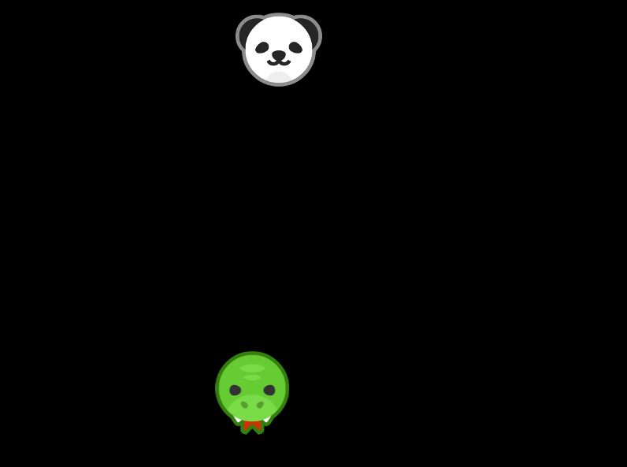

# Chapter 14 - Game: Shoot the enemy

A game is essentially a bunch of problems that you have to solve. When you ask an experienced programmer to make PONG, he won't look up a How to make PONG. They can divide PONG into separate problems, and know how to solve each one of them. This chapter is to show you how to split a game into multiple tasks.

The game we'll be making is simple: An enemy is bouncing against the walls. We have to shoot it. Each time we shoot it, the enemy goes a little faster. When you miss, it's game over and you'll have to start over again.
